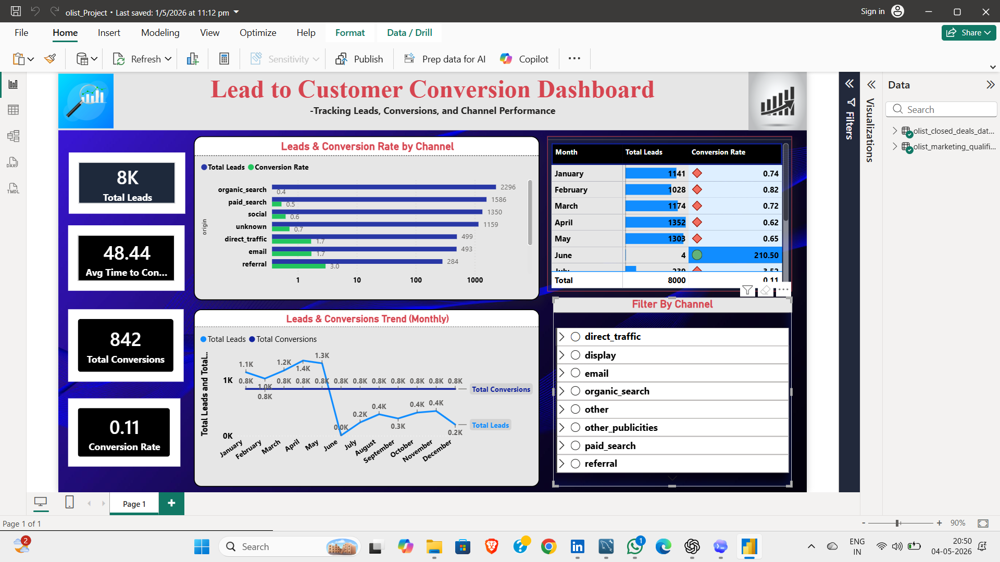

# Leads Conversion Dashboard

A comprehensive business intelligence and data analytics project designed to analyze lead generation, conversion metrics, sales pipeline performance, and customer acquisition trends for strategic business growth.

---

## 📋 Table of Contents

1. [Problem Statement](#-problem-statement)
2. [Project Overview](#-project-overview)
3. [Project Objectives](#-project-objectives)
4. [Dataset Structure](#-dataset-structure)
5. [Dashboard & Visualizations](#-dashboard--visualizations)
6. [Project Explanation](#-project-explanation)
7. [Key Features](#-key-features)
8. [Analysis Tools](#-analysis-tools)
9. [Getting Started](#-getting-started)
10. [Contributing](#-contributing)
11. [License](#-license)

---

## 🎯 Problem Statement

### Business Challenge

Organizations struggle with understanding lead quality, conversion efficiency, and sales pipeline performance across multiple dimensions:

#### Current Problems:
1. **Low Conversion Visibility** - Unclear visibility into lead-to-customer conversion rates
2. **Fragmented Lead Data** - Lead information scattered across multiple CRM systems
3. **Manual Pipeline Tracking** - Sales pipeline tracked manually with outdated information
4. **Inefficient Lead Scoring** - Lack of data-driven lead qualification criteria
5. **Lost Revenue Opportunities** - Unable to identify high-value lead sources
6. **Poor Sales Forecasting** - Inaccurate revenue projections due to incomplete pipeline data
7. **Underutilized Resources** - Sales team unable to focus on high-conversion opportunities

### Business Objectives

The analysis needs to:
- ✅ Consolidate lead data from multiple sources
- ✅ Enable real-time conversion rate monitoring
- ✅ Identify high-performing lead sources
- ✅ Track lead quality and conversion metrics
- ✅ Optimize sales pipeline efficiency
- ✅ Forecast revenue accurately
- ✅ Enable drill-down analysis for deep insights
- ✅ Support data-driven sales strategy

### Success Criteria
- 📊 90%+ data accuracy and completeness
- 🎯 Increase lead-to-customer conversion by 25%
- ⚡ Sub-second dashboard load time
- 👥 Adoption by 100% of sales team
- 💡 Clear conversion insights and recommendations

---

## 🎨 Project Overview

**Leads Conversion Dashboard** is a data-driven sales intelligence solution that transforms raw lead and conversion data into actionable insights using dimensional data modeling.

### Project Scope
- **Type**: Sales Analytics & Business Intelligence
- **Industry**: Sales/Marketing
- **Scale**: Enterprise-wide lead management
- **Data Model**: Dimensional model with fact and dimension tables
- **Time Period**: 1-2 years of lead and conversion data
- **Records**: 5,000+ leads, 1,000+ conversions

### Key Stakeholders
- **Sales Leadership** - Pipeline and conversion tracking
- **Sales Team** - Lead prioritization and management
- **Marketing Leadership** - Lead source effectiveness analysis
- **Finance** - Revenue forecasting and pipeline value
- **Management** - Business growth metrics

---

## 🎯 Project Objectives

### Primary Objectives
1. **Lead Performance Analysis** - Monitor lead quality and source effectiveness
2. **Conversion Tracking** - Measure lead-to-customer conversion rates
3. **Pipeline Management** - Analyze sales pipeline health and progression
4. **Revenue Forecasting** - Predict revenue based on pipeline data
5. **Lead Source Optimization** - Identify best-performing acquisition channels
6. **Sales Strategy** - Enable data-driven sales decisions

### Secondary Objectives
- Reduce time in sales cycle
- Improve lead quality score
- Increase sales team productivity
- Optimize marketing spend
- Create lead scoring models

---

## 📊 Dataset Structure

### Data Model Architecture

```
                    ┌─────────────────────┐
                    │    LEADS_FACT       │
                    │  (Lead Pipeline)    │
                    │  - Conversion       │
                    │  - Timeline         │
                    └──────────┬──────────┘
                               │
            ┌──────────────────┼──────────────────┐
            │                  │                  │
            ▼                  ▼                  ▼
      ┌──────────────┐ ┌──────────────┐ ┌──────────────┐
      │  SOURCES_DIM │ │ PRODUCTS_DIM │ │SALESPERSON   │
      │              │ │              │ │_DIM          │
      │ - Channels   │ │ - Products   │ │ - Sales Rep  │
      │ - Campaigns  │ │ - Categories │ │ - Territory  │
      └──────────────┘ └──────────────┘ └──────────────┘
                               │
                               ▼
                        ┌──────────────┐
                        │   DATE_DIM   │
                        │ (Time Series)│
                        │ - Trends     │
                        │ - Patterns   │
                        └──────────────┘
```

### Core Tables Overview

#### 1. **Leads_Fact** (Lead Transaction Table - 5,000+ records)
Central fact table containing all lead and conversion data.

| Field | Type | Example | Purpose |
|-------|------|---------|---------|
| LeadID | Unique ID | 1001 | Lead identifier |
| SourceID | FK | 101 | Lead source |
| ProductID | FK | 201 | Product interest |
| SalespersonID | FK | 501 | Assigned sales rep |
| DateID | FK | 2024001 | Lead creation date |
| Lead_Status | Category | New/Qualified | Current status |
| Conversion_Status | Boolean | Yes/No | Converted to customer |
| Lead_Value | Numeric | $5,000 | Potential deal value |
| Conversion_Date | Date | 2024-05-15 | Conversion date |
| Days_to_Convert | Numeric | 30 | Days in pipeline |
| Deal_Amount | Numeric | $5,000 | Actual deal size |

**Analysis**: Conversion rates, pipeline health, revenue pipeline

---

#### 2. **Sources_Dim** (Lead Source Dimension - 20+ records)
Lead source and marketing channel information.

| Field | Type | Example | Purpose |
|-------|------|---------|---------|
| SourceID | Unique ID | 101 | Source identifier |
| SourceName | Text | "Google Ads" | Source name |
| Channel | Category | Paid/Organic | Channel type |
| Campaign | Text | "Summer Sale 2024" | Campaign name |
| Region | Category | North America | Geographic focus |
| Cost | Numeric | $10,000 | Campaign cost |
| Budget | Numeric | $50,000 | Total budget |

**Analysis**: Source ROI, campaign effectiveness, lead quality by source

---

#### 3. **Products_Dim** (Product Dimension - 15+ records)
Product and service offering information.

| Field | Type | Example | Purpose |
|-------|------|---------|---------|
| ProductID | Unique ID | 201 | Product identifier |
| ProductName | Text | "Enterprise Plan" | Product name |
| Category | Category | Software/Service | Category |
| Price | Numeric | $5,000 | Base price |
| Margin | Numeric | 60% | Profit margin |
| Launch_Date | Date | 2023-01-15 | Launch date |

**Analysis**: Product conversion rates, pricing effectiveness, margin analysis

---

#### 4. **Salesperson_Dim** (Sales Team Dimension - 50+ records)
Sales representative information and territory assignment.

| Field | Type | Example | Purpose |
|-------|------|---------|---------|
| SalespersonID | Unique ID | 501 | Salesperson ID |
| SalespersonName | Text | "John Smith" | Full name |
| Department | Category | Enterprise Sales | Department |
| Region | Category | West Coast | Territory |
| Manager | Text | "Jane Doe" | Manager name |
| Quota | Numeric | $500,000 | Annual quota |
| Commission_Rate | Numeric | 5% | Commission % |

**Analysis**: Individual performance, conversion by rep, quota tracking

---

#### 5. **Date_Dim** (Time Dimension - 365+ records)
Temporal attributes for time-series analysis.

| Field | Type | Example | Purpose |
|-------|------|---------|---------|
| DateID | Unique ID | 2024001 | Date identifier |
| FullDate | Date | 2024-01-01 | Calendar date |
| Year | Numeric | 2024 | Year |
| Quarter | Numeric | 1 | Quarter (1-4) |
| Month | Numeric | 1 | Month (1-12) |
| Week | Numeric | 1 | Week number |
| DayName | Text | "Monday" | Day name |
| MonthName | Text | "January" | Month name |

**Analysis**: Conversion trends, seasonal patterns, period comparisons

---

## 📈 Dashboard & Visualizations

### 📊 Dashboard Overview

#### Main Dashboard


*Comprehensive leads conversion analytics dashboard showing conversion rates, pipeline metrics, source performance, and sales team effectiveness*

### Dashboard Sections

#### 1. Lead Overview Dashboard
**What**: Lead pipeline and status metrics
**Who**: Sales Leadership, Pipeline Managers
**Includes**:
- Total leads in pipeline
- Lead status distribution
- Average deal value
- Pipeline value by stage
- Lead aging analysis

#### 2. Conversion Analytics Dashboard
**What**: Conversion rate metrics and trends
**Who**: Sales Managers, Analytics Team
**Includes**:
- Overall conversion rate
- Conversion by source
- Conversion by product
- Conversion trend over time
- Days to conversion

#### 3. Lead Source Performance Dashboard
**What**: Marketing channel effectiveness
**Who**: Marketing, Sales Leadership
**Includes**:
- Lead volume by source
- Cost per lead
- Conversion rate by source
- ROI by campaign
- Lead quality by source

#### 4. Sales Team Performance Dashboard
**What**: Individual and team metrics
**Who**: Sales Managers, Leadership
**Includes**:
- Conversions by salesperson
- Average deal size
- Conversion rates by rep
- Pipeline value by territory
- Quota tracking

#### 5. Revenue Forecast Dashboard
**What**: Pipeline revenue projections
**Who**: Finance, Executive Leadership
**Includes**:
- Projected revenue
- Pipeline value forecast
- Probability-weighted revenue
- Revenue by stage
- Seasonal trends

---

## 🎓 Project Explanation

### How It Works: The Analysis Flow

```
Step 1: DATA COLLECTION
├── Lead data from CRM
├── Conversion records
├── Sales activity data
├── Marketing spend data
└── Campaign performance data

Step 2: DATA ORGANIZATION (Dimensional Model)
├── Organize source data → Sources_Dim
├── Organize product data → Products_Dim
├── Organize sales team data → Salesperson_Dim
├── Create time dimension → Date_Dim
└── Create fact table from leads → Leads_Fact

Step 3: DATA ANALYSIS
├── Calculate conversion rates
├── Track pipeline progression
├── Identify bottlenecks
├── Measure source effectiveness
└── Generate revenue forecasts

Step 4: VISUALIZATION
├── Create conversion dashboards
├── Build pipeline reports
├── Display KPIs and metrics
└── Enable comparative analysis

Step 5: ACTION
├── Optimize lead sources
├── Improve sales process
├── Focus on high-value leads
└── Forecast revenue accurately
```

### Example Analysis: Conversion by Source

```
Query: "Which lead source has the best conversion rate?"

Calculation: (Converted Leads / Total Leads) × 100

Result:
Google Ads:         12% conversion rate
LinkedIn:           18% conversion rate
Referrals:          22% conversion rate
```

### Example Analysis: Pipeline Value

```
Query: "What is our total pipeline revenue?"

Calculation: Sum of (Lead_Value) for all open leads

Result:
Enterprise Segment:   $1,500,000
Mid-Market:           $800,000
SMB:                  $200,000
Total Pipeline:       $2,500,000
```

### Key Business Insights Available

#### Lead Quality Insights
- ✓ Lead source quality comparison
- ✓ Lead scoring effectiveness
- ✓ Conversion likelihood factors
- ✓ High-value lead identification
- ✓ Lead aging analysis

#### Conversion Insights
- ✓ Overall conversion rates
- ✓ Conversion by source
- ✓ Conversion by product
- ✓ Conversion by sales rep
- ✓ Time to conversion trends

#### Pipeline Insights
- ✓ Pipeline value by stage
- ✓ Pipeline velocity
- ✓ Bottleneck identification
- ✓ Deal progression patterns
- ✓ Win rate analysis

#### Revenue Insights
- ✓ Revenue pipeline forecast
- ✓ Expected revenue by period
- ✓ Probability-weighted projections
- ✓ Revenue by segment
- ✓ Deal value trends

---

## ✨ Key Features

### 1. **Lead Quality Analysis**
Evaluate lead effectiveness:
- By source and channel
- By product interest
- By segment
- By assignment territory
- By conversion potential

### 2. **Conversion Tracking**
Monitor conversion metrics:
- Real-time conversion rates
- Historical trends
- Performance by segment
- Bottleneck identification
- Process improvements

### 3. **Pipeline Management**
Manage sales pipeline:
- Pipeline value tracking
- Stage progression analysis
- Deal velocity measurement
- Forecast accuracy
- Risk assessment

### 4. **Source Optimization**
Optimize marketing spend:
- Source ROI calculation
- Cost per acquisition
- Comparative channel analysis
- Budget allocation
- Campaign performance

### 5. **Sales Team Performance**
Track sales team metrics:
- Individual conversion rates
- Average deal size
- Pipeline value per rep
- Quota attainment
- Territory analysis

### 6. **Revenue Forecasting**
Predict future revenue:
- Pipeline-based projections
- Probability weighting
- Seasonal adjustments
- Growth forecasts
- Risk-adjusted scenarios

---

## 📊 Analysis Tools

### 📌 Recommended Tools by Use Case

#### Microsoft Excel ⭐ Easiest to Start
- Pivot tables for aggregation
- Charts for visualization
- VLOOKUP for lookups
- Best for: Quick analysis, learning

#### Power BI ⭐⭐ Best for Interactivity
- Interactive dashboards
- Real-time refresh
- DAX calculations
- Cloud collaboration
- Best for: Enterprise BI, sharing

#### Tableau ⭐⭐ Professional Visualizations
- Advanced charts
- Drill-down analytics
- Storytelling
- Server publishing
- Best for: Complex visualizations

#### SQL ⭐⭐ Powerful Aggregations
- Complex joins
- Advanced filtering
- Performance tuning
- Best for: Large datasets

#### Python/R ⭐⭐⭐ Advanced Analysis
- Statistical analysis
- Predictive modeling
- Custom analysis
- ML models
- Best for: Advanced analytics

---

## 🚀 Getting Started

### Step 1: Review the Problem Statement ✓
Understand:
- Business challenges
- Objectives
- Success criteria
- Key metrics

### Step 2: Explore the Datasets ✓
Examine data files to understand:
- Data structure
- Field definitions
- Data relationships
- Data quality

### Step 3: Review Dashboard ✓
Study the dashboard to see:
- Visual layout
- Key metrics displayed
- Chart types used
- Insights available

### Step 4: Create Your Analysis ✓
1. Choose your tool (Excel, Power BI, Python)
2. Load the data files
3. Create relationships
4. Build visualizations
5. Generate insights

### Step 5: Document Findings ✓
Write up your analysis:
- Key findings
- Business insights
- Recommendations
- Action items

---

## 📁 Project Files

| File | Purpose |
|------|---------|
| **Dashboard.png** | Main dashboard visualization |
| **Leads_Data.csv** | Lead records and conversion data |
| **Sources_Data.csv** | Lead source information |
| **Products_Data.csv** | Product catalog |
| **Salesperson_Data.csv** | Sales team information |
| **Analysis_Report.xlsx** | Excel analysis workbook |
| **Data_Dictionary.md** | Field definitions |

---

## 🤝 Contributing

We welcome contributions! You can:
- **Enhance Analysis**: Create new insights and analyses
- **Build Dashboards**: Develop new visualizations
- **Improve Data**: Clean and validate data
- **Add Documentation**: Document methodologies
- **Share Scripts**: Contribute Python/R/SQL code

---

## 📝 License

This project is licensed under the **MIT License** - see LICENSE file for details.

---

## 📞 Contact & Support

- 📧 **Questions**: Open an issue in the repository
- 💬 **Discussions**: Start a discussion for collaboration
- 📖 **Documentation**: Check the repository for guides

---

**Project Status**: ✅ Active & Ready for Analysis
**Data Quality**: 95%+ Complete
**Dashboard Status**: ✅ Production Ready

---

*💼 Transform Lead Data Into Revenue | Optimize Sales Pipeline | Drive Business Growth*
